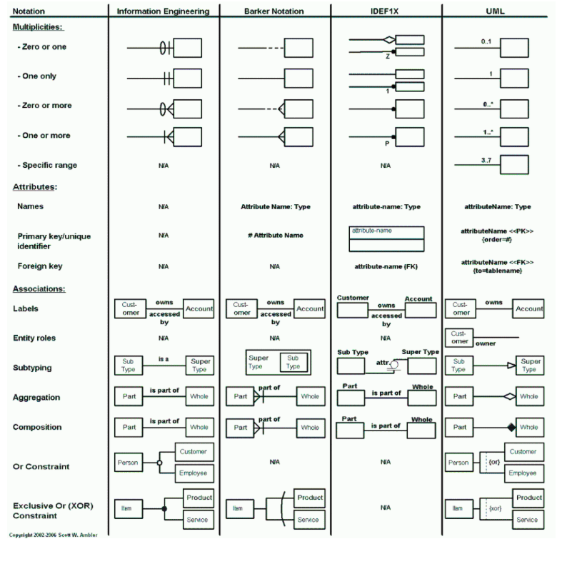

Data Modelling 101
==================

Data modeling is the act of exploring data-oriented structures. 
It is conceptually similar to class modeling in object orriented programming. 

* With data modeling you identify `entity types` whereas with class modeling you `identify classes`. 

* `Data attributes` are assigned to `entity types` just as you would assign `attributes` and `operations` to `classes`. 

* There are associations between entities, similar to the associations between classes.

* Just like in classes relationships, inheritance, composition, and aggregation are all applicable concepts in data modeling.

.. note::

    Data modeling focuses solely on `data` while class models allow you to explore both the `behavior` 
    and `data` aspects of your domain.

Common Modelling Notations
-------------------------

+----------+--------------------------------------------------------------------------------------------------------------------------------------------------------------------------------------------------------------------------------------------------------------------------------------------------------------------------------------------------------------------------------------------+
| Notation | Comments                                                                                                                                                                                                                                                                                                                                                                                  |
+==========+==============================================================================================================================================================================================================================================================================================================================+
| IE       | The IE notation (Finkelstein 1989) is simple and easy to read, and is well suited for high-level logical and enterprise data modeling. The only drawback of this notation, arguably an advantage, is that it does not support the identification of attributes of an entity. The assumption is that the attributes will be modeled with another diagram or simply described in the supporting documentation. |
+----------+--------------------------------------------------------------------------------------------------------------------------------------------------------------------------------------------------------------------------------------------------------------------------------------------------------------------------------------------------------------------------------------------+
| Barker   | The Barker notation is one of the more popular ones, it is supported by Oracle’s toolset, and is well suited for all types of data models. It's approach to subtyping can become clunky with hierarchies that go several levels deep.                                                                                          |
+----------+--------------------------------------------------------------------------------------------------------------------------------------------------------------------------------------------------------------------------------------------------------------------------------------------------------------------------------------------------------------------------------------------+
| IDEF1X   | This notation is overly complex. It was originally intended for physical modeling but has been misapplied for logical modeling as well. Although popular within some U.S. government agencies, particularly the Department of Defense (DoD), this notation has been all but abandoned by everyone else. Avoid it if you can.                 |
+----------+--------------------------------------------------------------------------------------------------------------------------------------------------------------------------------------------------------------------------------------------------------------------------------------------------------------------------------------------------------------------------------------------+
| UML      | This is not an official data modeling notation (yet). Although several suggestions for a data modeling profile for the UML exist, none are complete and more importantly are not “official” UML yet. However, the Object Management Group (OMG) in December 2005 announced an RFP for data-oriented models.                                  |
+----------+--------------------------------------------------------------------------------------------------------------------------------------------------------------------------------------------------------------------------------------------------------------------------------------------------------------------------------------------------------------------------------------------+

How to Model Data
-----------------

Suppose we are designing an experiment that collects data from a patient.
* From the patient, we collect blood and urine samples.
* From the blood, we extract plasma and DNA.
* From the DNA, we generate a sequencing run.

We will use the following steps to model this data. 

1. Identify Entity Types
2. Identify Attributes
3. Identify Relationships
4. Assign Keys
5. Data Normalization

Identify Entity Types
~~~~~~~~~~~~~~~~~~~~~~~~~~~~~~

An entity type (or entities ) is 
* conecptually similar to a class in object oriented programming.
*  represents a collection of similar objects.
* depicts a single conceptual object in the real world.

In our example the entities will be: 
    - Patient 
    - Blood
    - Urine
    - Plasma
    - DNA
    - Serum

Identify Attributes
~~~~~~~~~~~~~~~~~~~~~~~~~~~~~~

* Each entity has 1+ attributes.
* An attribute is a property or characteristic of an entity type.
* An attribute describes a single aspect of an entity type.
* An attribute has a name and a data type.

In our example the attributes will be:
* Patient: patient_id
* Blood: blood_id, patient_id, blood_type
* Urine: urine_id, patient_id
* Plasma: plasma_id, blood_id
* DNA: dna_id, blood_id, dna_specimen_id
* Seqrum: seqrum_id, dna_id

Identify Relationships
~~~~~~~~~~~~~~~~~~~~~~~~~~~~~~

* Entities are related to each other through relationships.
* It is similar to the concept of associations in object oriented programming.
* Once relationships are identified, we can determine the `cardinality`.
* Cardinality: The number of instances of one entity that can be associated with instances of another entity
    - One to One
    - One to Many
    - Many to Many
    - In our example the relationships will be:
        #. Patient to Blood: One to Many
        #. Patient to Urine: One to Many
        #. Blood to Plasma: One to One
        #. Blood to DNA: One to One
        #. DNA to Seqrum: Many to One

Assign Keys
~~~~~~~~~~~~~~~~~~~~~~~~~~~~~~

A key is an attribute or set of attributes used to uniquely identify records and define relationships between entities.

**Candidate Key**: A candidate key is any column or combination of columns that could uniquely identify a row in a table.
For example, in the `Patient` table, `patient_id` is a natural candidate key because it uniquely identifies each patient.

**Primary Key**: The primary key is the **chosen** candidate key that becomes the main identifier for the table.
It must be unique and not null.

In our example, the primary keys for each entity are:

- `Patient`: `patient_id`
- `Blood`: `blood_id`
- `Urine`: `urine_id`
- `Plasma`: `plasma_id`
- `DNA`: `dna_id`
- `Seqrum`: `seqrum_id`

**Foreign Key**: A foreign key is an attribute in one table that references the primary key of another table.
It is used to link related records across entities.

In our example, the foreign keys are:

- `Blood.patient_id` is a foreign key to `Patient.patient_id`
- `Urine.patient_id` is a foreign key to `Patient.patient_id`
- `Plasma.blood_id` is a foreign key to `Blood.blood_id`
- `DNA.blood_id` is a foreign key to `Blood.blood_id`
- `Seqrum.dna_id` is a foreign key to `DNA.dna_id`

Entity-by-entity key summary:

+-----------+----------------------+-----------------------+-------------------------------------------+
| Entity    | Candidate key(s)     | Primary key           | Foreign keys                              |
+===========+======================+=======================+===========================================+
| Patient   | patient_id           | patient_id            | None                                      |
+-----------+----------------------+-----------------------+-------------------------------------------+
| Blood     | blood_id, patient_id | blood_id              | patient_id -> Patient.patient_id           |
+-----------+----------------------+-----------------------+-------------------------------------------+
| Urine     | urine_id, patient_id | urine_id             | patient_id -> Patient.patient_id           |
+-----------+----------------------+-----------------------+-------------------------------------------+
| Plasma    | plasma_id, blood_id  | plasma_id            | blood_id -> Blood.blood_id                |
+-----------+----------------------+-----------------------+-------------------------------------------+
| DNA       | dna_id, blood_id     | dna_id               | blood_id -> Blood.blood_id                |
+-----------+----------------------+-----------------------+-------------------------------------------+
| Seqrum    | seqrum_id, dna_id    | seqrum_id            | dna_id -> DNA.dna_id                      |
+-----------+----------------------+-----------------------+-------------------------------------------+

This example shows how identifiers allow us to distinguish each record and enforce relationships between related data.

Data Normalization
~~~~~~~~~~~~~~~~~~~~~~~~~~~~~~

- Data normalization is the process of organizing data to minimize (or eliminate) redundancy and improve data integrity.
- There are 3 main normal forms (1NF, 2NF, 3NF) that are commonly used in relational database design.

Using the patient study example:

**First normal form (1NF)**: An entity is in 1NF when it has no repeating groups of data and each field contains a single value.

For example, in the `Blood` table, each row should represent one blood sample only.
We should not store multiple blood samples in a single row such as:

- `blood_id = B001`
- `sample_1 = ...`
- `sample_2 = ...`

Instead, each row should contain one value per attribute, and each record should be stored separately.
This ensures that each blood sample has one `blood_id`, one `patient_id`, and one `blood_type` value.

**Second normal form (2NF)**: A table is in 2NF when it is already in 1NF and every non-key attribute is fully dependent on the whole primary key.

In our example, the `DNA` table has a primary key like `dna_id`.
If we store `blood_id`, `dna_specimen_id`, and `patient_id` in the same table, then `patient_id` is not directly dependent on `dna_id` alone; it depends on the blood sample that the DNA came from.

This means the relation should be split so that:

- `Patient` stores patient information
- `Blood` stores blood-specific information
- `DNA` stores DNA-specific information

This avoids duplication and ensures that each attribute belongs to the correct entity.

**Third normal form (3NF)**: A table is in 3NF when it is in 2NF and no non-key attribute depends on another non-key attribute.

For example, suppose we stored `patient_name` in the `Blood` table.
That would be a problem because `patient_name` depends on `patient_id`, not directly on `blood_id`.
The name belongs in the `Patient` table, not in `Blood`.

Similarly, if a `DNA` row stored the patient name or blood type, that would violate 3NF because those values are not directly about the DNA itself; they are inherited from related entities.

In a well-normalized design:

- `Patient` contains patient-specific information
- `Blood` contains blood-specific information
- `DNA` contains DNA-specific information
- each table relates to others using keys instead of repeating the same data

This minimizes redundancy and keeps the database easier to query, update, and maintain.

Entity Relationship (ER) diagrams
-----------------------------------

ER diagrams are a visual representation of the relationships between entities in a database.
They help to illustrate how data is structured and how different entities interact with each other.

.. image:: images/02-er-diagram.png
   :alt: Entity relationship diagram showing patient, blood, urine, plasma, DNA, and sequencing run entities
   :align: center

- `Entities`: The boxes represent entity types such as `Patient`, `Blood`, `Urine`, `Plasma`, `DNA`, and `SeqRun`.
- `Attributes`: Each entity contains its own characteristics, such as `patient_id`, `blood_id`, `dna_id`, and `run_date`.
- `Relationships`: The arrows show how entities are connected. For example, a patient has many blood samples, and a blood sample produces DNA.
- `Cardinality`: The different arrow heads show how many records on one side can relate to the other side. For example, one patient can have many blood samples.
- `Primary keys`: The identifier inside each entity, such as `patient_id` or `blood_id`, uniquely identifies that table's rows.
- `Foreign keys`: The attributes such as `Blood.patient_id` and `DNA.blood_id` connect each entity back to its parent record.

