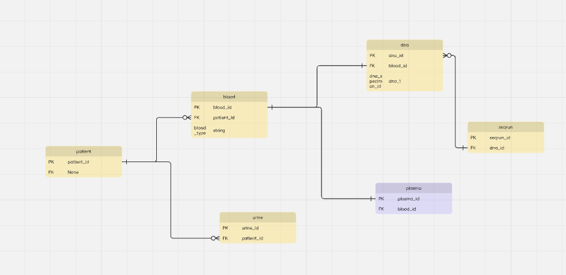

Data Modelling 101
==================

Data modelling is the act of exploring data-oriented structures. 
It is conceptually similar to class modelling in object oriented programming.

* With data modelling you identify `entity types` whereas with class modelling you `identify classes`. 

* `Data attributes` are assigned to `entity types` just as you would assign `attributes` and `operations` to `classes`. 

* There are associations between entities, similar to the associations between classes.

* Just like in classes relationships, inheritance, composition, and aggregation are all applicable concepts in data modelling.

.. note::

    Data modelling focuses solely on `data` while class models allow you to explore both the `behaviour` 
    and `data` aspects of your domain.

How to Model Data
-----------------

.. admonition:: Example: from patient to sequencing run

  Consider an experiment that follows biological material from a patient
  through to sequencing:

  * We collect blood and urine samples from the patient.

  * We extract plasma and DNA from the blood.

  * We generate a sequencing run from the DNA.

We will use the following steps to model this data. 

1. Identify Entity Types
2. Identify Attributes
3. Identify Relationships
4. Assign Keys
5. Data Normalisation

Identify Entity Types
~~~~~~~~~~~~~~~~~~~~~~~~~~~~~~

An entity type (or entities ) is:

* conceptually similar to a class in object oriented programming.

* represents a collection of similar objects.

* depicts a single conceptual object in the real world.

In our example the entities will be: 
    - Patient 
    - Blood
    - Urine
    - Plasma
    - DNA
    - Serum

Identify Attributes
~~~~~~~~~~~~~~~~~~~~~~~~~~~~~~

* Each entity has 1+ attributes.
* An attribute is a property or characteristic of an entity type.
* An attribute describes a single aspect of an entity type.
* An attribute has a name and a data type.

In our example the attributes will be:

* Patient: patient_id

* Blood: blood_id, patient_id, blood_type

* Urine: urine_id, patient_id

* Plasma: plasma_id, blood_id

* DNA: dna_id, blood_id, dna_specimen_id

* SeqRun: seqrun_id, dna_id

Identify Relationships
~~~~~~~~~~~~~~~~~~~~~~~~~~~~~~

* Entities are related to each other through relationships.
* It is similar to the concept of associations in object oriented programming.
* Once relationships are identified, we can determine the `cardinality` and `optionality`.
* Cardinality: The number of instances of one entity that can be associated with instances of another entity
    - One to One
    - One to Many
    - Many to Many
    - In our example the relationships will be:
        #. Patient to Blood: One to Many
        #. Patient to Urine: One to Many
        #. Blood to Plasma: One to One
        #. Blood to DNA: One to One
        #. DNA to SeqRun: Many to One

* Optionality: Whether an instance of one entity must be associated with an instance of another entity
    - Optional: An instance of one entity may or may not be associated with an instance of another entity
    - Mandatory: An instance of one entity must be associated with an instance of another entity
    - In our example the relationships will be:
        #. Patient to Blood: Optional
        #. Patient to Urine: Optional
        #. Blood to Plasma: Mandatory
        #. Blood to DNA: Mandatory
        #. DNA to SeqRun: Optional

Assign Keys
~~~~~~~~~~~~~~~~~~~~~~~~~~~~~~

A key is an attribute or set of attributes used to uniquely identify records and define relationships between entities.

**Candidate Key**: A candidate key is any column or combination of columns that could uniquely identify a row in a table.
For example, in the `Patient` table, `patient_id` is a natural candidate key because it uniquely identifies each patient.

**Primary Key**: The primary key is the **chosen** candidate key that becomes the main identifier for the table.
It must be unique and not null.

In our example, the primary keys for each entity are:

- `Patient`: `patient_id`
- `Blood`: `blood_id`
- `Urine`: `urine_id`
- `Plasma`: `plasma_id`
- `DNA`: `dna_id`
- `SeqRun`: `seqrun_id`

**Foreign Key**: A foreign key is an attribute in one table that references the primary key of another table.
It is used to link related records across entities.

In our example, the foreign keys are:

- `Blood.patient_id` is a foreign key to `Patient.patient_id`
- `Urine.patient_id` is a foreign key to `Patient.patient_id`
- `Plasma.blood_id` is a foreign key to `Blood.blood_id`
- `DNA.blood_id` is a foreign key to `Blood.blood_id`
- `SeqRun.dna_id` is a foreign key to `DNA.dna_id`

Entity-by-entity key summary:

+-----------+----------------------+-----------------------+-------------------------------------------+
| Entity    | Candidate key(s)     | Primary key           | Foreign keys                              |
+===========+======================+=======================+===========================================+
| Patient   | patient_id           | patient_id            | None                                      |
+-----------+----------------------+-----------------------+-------------------------------------------+
| Blood     | blood_id, patient_id | blood_id              | patient_id -> Patient.patient_id           |
+-----------+----------------------+-----------------------+-------------------------------------------+
| Urine     | urine_id, patient_id | urine_id             | patient_id -> Patient.patient_id           |
+-----------+----------------------+-----------------------+-------------------------------------------+
| Plasma    | plasma_id, blood_id  | plasma_id            | blood_id -> Blood.blood_id                |
+-----------+----------------------+-----------------------+-------------------------------------------+
| DNA       | dna_id, blood_id     | dna_id               | blood_id -> Blood.blood_id                |
+-----------+----------------------+-----------------------+-------------------------------------------+
| SeqRun    | seqrun_id, dna_id    | seqrun_id            | dna_id -> DNA.dna_id                      |
+-----------+----------------------+-----------------------+-------------------------------------------+

This example shows how identifiers allow us to distinguish each record and enforce relationships between related data.

Data Normalisation
~~~~~~~~~~~~~~~~~~~~~~~~~~~~~~

- Data normalisation is the process of organising data to minimise (or eliminate) redundancy and improve data integrity.
- There are 3 main normal forms (1NF, 2NF, 3NF) that are commonly used in relational database design.

Using the patient study example:

**First normal form (1NF)**: An entity is in 1NF when it has no repeating groups of data and each field contains a single value.

For example, in the `Blood` table, each row should represent one blood sample only.
We should not store multiple blood samples in a single row such as:

- `blood_id = B001`
- `sample_1 = ...`
- `sample_2 = ...`

Instead, each row should contain one value per attribute, and each record should be stored separately.
This ensures that each blood sample has one `blood_id`, one `patient_id`, and one `blood_type` value.

**Second normal form (2NF)**: A table is in 2NF when it is already in 1NF and every non-key attribute is fully dependent on the whole primary key.

In our example, the `DNA` table has a primary key like `dna_id`.
If we store `blood_id`, `dna_specimen_id`, and `patient_id` in the same table, then `patient_id` is not directly dependent on `dna_id` alone; it depends on the blood sample that the DNA came from.

This means the relation should be split so that:

- `Patient` stores patient information
- `Blood` stores blood-specific information
- `DNA` stores DNA-specific information

This avoids duplication and ensures that each attribute belongs to the correct entity.

**Third normal form (3NF)**: A table is in 3NF when it is in 2NF and no non-key attribute depends on another non-key attribute.

For example, suppose we stored `patient_name` in the `Blood` table.
That would be a problem because `patient_name` depends on `patient_id`, not directly on `blood_id`.
The name belongs in the `Patient` table, not in `Blood`.

Similarly, if a `DNA` row stored the patient name or blood type, that would violate 3NF because those values are not directly about the DNA itself; they are inherited from related entities.

In a well-normalised design:

- `Patient` contains patient-specific information
- `Blood` contains blood-specific information
- `DNA` contains DNA-specific information
- each table relates to others using keys instead of repeating the same data

This minimises redundancy and keeps the database easier to query, update, and maintain.

Entity Relationship (ER) diagrams
-----------------------------------

ER diagrams are a visual representation of the relationships between entities in a database.
They help to illustrate how data is structured and how different entities interact with each other.

.. note::

    There are different types of notations available for an ER diagram. Here we are using Barker notation.

Entities
~~~~~~~~~~~~~~~~

An entity is drawn as a rounded rectangle, with its singular name at the top and its attributes inside. For example:

.. code-block:: text

   .----------------------.
   | PATIENT              |
   |----------------------|
   | # patient_id         |
   | * name               |
   | o date_of_birth      |
   '----------------------'

Attributes
~~~~~~~~~~~~~~~~

The symbol before an attribute describes its role:

.. list-table:: Attribute symbols
   :header-rows: 1
   :widths: 15 35 50

   * - Symbol
     - Meaning
     - Example
   * - ``#``
     - Part of a unique identifier
     - ``# patient_id`` identifies a patient.
   * - ``*``
     - Mandatory attribute
     - ``* name`` requires a value.
   * - ``o``
     - Optional attribute
     - ``o date_of_birth`` may have no value.

Relationships
~~~~~~~~~~~~~~~~

A relationship is labelled with a meaningful phrase in each direction. Its notation describes both cardinality (one or many) and
optionality (whether participation is required).

Cardinality
~~~~~~~~~~~

.. list-table:: Relationship shapes
   :header-rows: 1
   :widths: 25 40 35

   * - Relationship
     - Notation
     - Example
   * - One-to-one
     - No crow's foot at either end
     - A sample and its single storage record.
   * - One-to-many
     - Crow's foot at the many end
     - A patient and their samples; the crow's foot is at SAMPLE.
   * - Many-to-many
     - Crow's foot at both ends
     - Patients and studies, where each can be associated with several of the other.

These examples assume the stated modelling rules. Cardinality alone does not
say whether a relationship is optional.

Optional and mandatory participation
~~~~~~~~~~~~~~~~~~~~~~~~~~~~~~~~~~~~

Each half of a relationship line can have a different style. To read from
entity A to entity B, use the line style beside A and the endpoint beside B.

.. list-table:: Reading from A to B
   :header-rows: 1
   :widths: 30 35 35

   * - Line beside A
     - Endpoint beside B
     - Meaning
   * - Dashed
     - No crow's foot
     - A may relate to zero or one B.
   * - Solid
     - No crow's foot
     - A must relate to exactly one B.
   * - Dashed
     - Crow's foot
     - A may relate to zero or many Bs.
   * - Solid
     - Crow's foot
     - A must relate to one or many Bs.

For example, suppose a patient may provide samples, but every sample must
belong to one patient:

.. code-block:: text

   [PATIENT] - - - - --------< [SAMPLE]
               provides
               belongs to

.. note::
    
    Here, ``<`` is a text approximation of a crow's foot. The dashed half beside
    PATIENT makes providing samples optional. The solid half beside SAMPLE makes
    belonging to a patient mandatory. The crow's foot at SAMPLE allows many samples
    per patient; the plain endpoint at PATIENT allows one patient per sample.

A recursive relationship loops back to the same entity, such as a staff member
supervising other staff members. Its ends use the same cardinality and
optionality rules.

.. note::

   * In Barker notation, dashed and solid lines indicate optional and mandatory
     participation, respectively.
   * A short bar across a relationship near an entity indicates that the
     relationship contributes to that entity's unique identifier.

.. admonition:: TODO: What is the intended DNA-to-SeqRun relationship?

   Can one DNA sample have several sequencing runs, or can one sequencing run
   contain several DNA samples?

   The relationship list says **DNA to SeqRun: Many to One**. This means
   several DNA records can relate to one sequencing run. However, the attribute
   list places ``dna_id`` inside ``SeqRun`` as a foreign key. A foreign key
   stores the identifier of a related record, so each ``SeqRun.dna_id`` value
   points to one DNA record.

   For example, if RUN001 and RUN002 both store DNA001 in their ``dna_id``
   field, one DNA record has two sequencing runs. Unless ``SeqRun.dna_id`` is
   constrained to be unique, this structure permits **DNA to SeqRun: One to
   Many**, which is the reverse of the stated relationship.

   If one DNA sample can have several sequencing runs, keep ``SeqRun.dna_id``
   as the foreign key, change the relationship to one-to-many, and place the
   diagram's crow's foot at the SeqRun end. In a simple one-to-many
   relationship, the foreign key belongs on the many side.

   Confirm the intended relationship before changing the model, then make
   the relationship list, foreign keys, and diagram agree.
