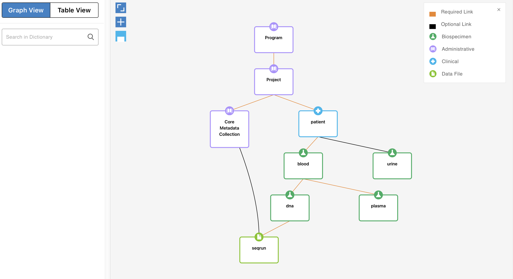
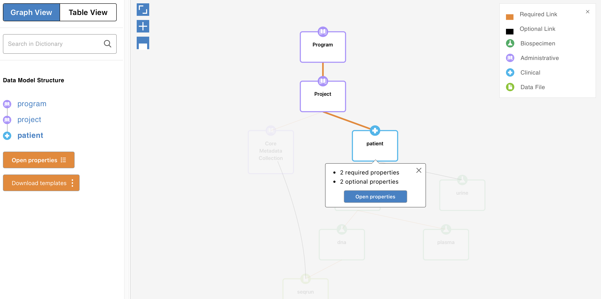
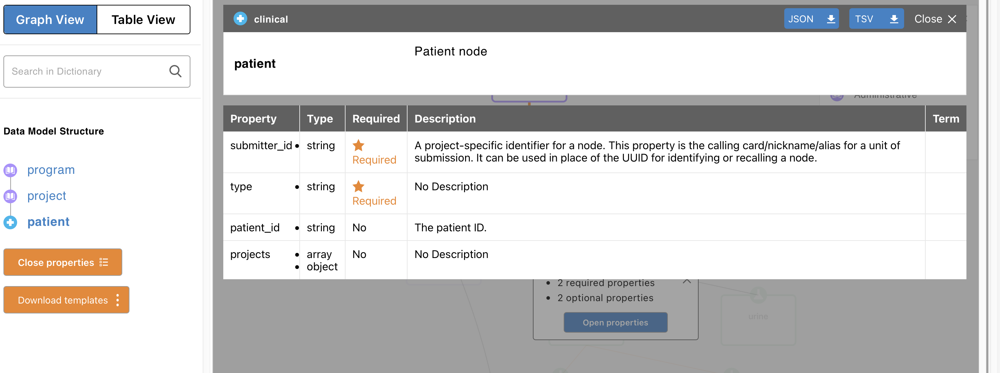

Build data dictionary
============================

The input file is stored at ``sample-data-dict/input.yaml``. To generate the data dictionary, run the following commands from the ``sample-data-dict`` directory:

.. code-block:: bash

	mkdir -p output_schema

	gen3schemadev generate -i input.yaml -o output_schema

Validate the generated schemas before bundling them:

.. code-block:: bash

	gen3schemadev validate -y output_schema

Fix validation errors in ``input.yaml``, remove or regenerate the generated output if necessary, and run the generation and validation commands again.
Now the individual node schemas can be combined into one JSON file. Create a directory for JSON output and write the bundle there:

.. code-block:: bash

	mkdir -p output_json

	gen3schemadev bundle -i output_schema -f output_json/bundled_schema.json

The resulting ``output_json/bundled_schema.json`` contains the schemas needed to represent the complete data dictionary.
Then generate a visual representation from the bundled schema:

.. code-block:: bash

	gen3schemadev visualise -i output_json/bundled_schema.json

You should be able to see the visual representation of the data dictionary in your browser. 

Complete workflow
-----------------

From ``sample-data-dict``, the complete workflow is:

.. code-block:: bash

	mkdir -p output_schema output-json

	gen3schemadev generate -i input.yaml -o output-schema

	gen3schemadev validate -y output-schema

	gen3schemadev bundle -i output_schema -f output-json/bundled-schema.json

	gen3schemadev visualise -i output-json/bundled-schema.json

After changing ``input.yaml``, repeat the workflow so that the generated schemas and bundled JSON reflect the updated data model.

