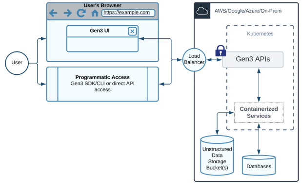

GEN3 Overview
====================

Gen3 is an open-source platform for building data commons, data meshes, data
hubs, and secure analysis workspaces. It helps research communities manage,
share, discover, and analyse data while retaining control over access.

Why Gen3?
---------

Sharing research data is difficult for several reasons:

* Researchers may have little incentive to share data after its original use.
* Incomplete or low-quality metadata can make data difficult to understand and
  reuse.
* Incompatible architectures, closed interfaces, and non-standard protocols
  can prevent systems from exchanging data.

Gen3 addresses these problems by combining data management, discovery, access
control, and analysis services in a secure platform. Operators decide how
public their systems and data should be, while open APIs and standard
protocols allow Gen3 deployments to interoperate.

FAIR data principles
--------------------

Gen3 is designed to support the FAIR data principles:

1. **Findable**: Metadata and query services index data with unique, persistent identifiers
   and make the data searchable across resources.

2. **Accessible**: Authentication and authorisation services protect data, while a web portal
   lets authorised users explore projects and launch analysis workspaces.

3. **Interoperable**: Open APIs use common protocols and formats so that Gen3 can communicate
   with other data resources.

4. **Reusable**: Data models give contributors a shared vocabulary for clinical,
   phenotypic, biospecimen, and file metadata.

Main Offerings
-----------------

Data commons
~~~~~~~~~~~~~~~~~~~~~~

A data commons places data management services alongside tools for data
exploration, analysis, and visualisation. It can manage structured information,
such as clinical, phenotypic, and biospecimen data, as well as unstructured
objects such as genomic files and medical images. A data commons can also
interoperate with other resources in a data mesh.

`data.midrc.org <https://data.midrc.org/>`_ is an example of a Gen3 data commons.

Data meshes and mesh services
~~~~~~~~~~~~~~~~~~~~~~~~~~~~~~~~~~~~~~~~~~~~

A data mesh, also called a data ecosystem or data fabric, consists of two or
more data commons, repositories, knowledge bases, or applications that use a
common set of services. The mesh connects data held by its member nodes; it
does not need to move all data into one central location.

Mesh services provide open APIs for:

* indexing data objects;
* associating metadata with those objects; and
* controlling user access.

`healdata.org <https://healdata.org/>`_ is an example of a Gen3 data mesh.

Data hubs
~~~~~~~~~~~~~~~~~~~~~~

A data hub provides a single discovery interface or API for finding and
combining information across a data mesh. The hub stores persistent
identifiers, URLs, or other pointers to data, while the platforms that host the
files continue to manage access to them.

Workspaces
~~~~~~~~~~~~~~~~~~~~~~

Gen3 workspaces are secure cloud analysis environments that can access data
from one or more resources. The default workspace applications include
JupyterLab and RStudio, but operators can provide other applications, analysis
workflows, processing pipelines, and visualisation tools.

Workspaces use Gen3 mesh services to authenticate and authorise users and to
retrieve data objects and metadata. Workspace images can contain different
software packages and tutorials, and operators can offer virtual machines with
different compute resources. A persistent drive retains a user's notebooks,
results, and other artefacts between sessions.

Core capabilities
-----------------

Data management
~~~~~~~~~~~~~~~

Gen3 manages three broad types of data:

1. **Structured data**: Tables or JSON records that conform to a data model. The model harmonises
   submitted data and defines links between related records. Structured data
   is used to build cohorts and identify files of interest.

2. **Unstructured data**: Files stored in object storage or indexed in place. Each file receives a
   persistent identifier, such as a GUID, and can be downloaded or sent to an
   analysis environment when the user is authorised.

3. **Semi-structured data**: Flexible JSON records that can contain nested fields without requiring a
   fixed hierarchy. Typical uses include dataset discovery metadata,
   privacy-preserving record linkage crosswalks, and package metadata.

Data access
~~~~~~~~~~~

Gen3 uses attribute-based access control to protect data, compute resources,
and user-interface components. :doc:`Arborist <01-arborist>` is the policy engine. Access rules
can be maintained in YAML allowlists or synchronised with an external
authorisation source.

Users can access data in several ways:

* Structured data is available through APIs, queries, the Exploration page,
  and table exports.
* Semi-structured metadata is available from the Discovery page, where related
  files can be downloaded or exported to workspaces.
* Files are retrieved by GUID through the portal's file endpoint, the Gen3
  Python SDK, or the ``gen3-client`` command-line tool.

Data search
~~~~~~~~~~~

:doc:`Peregrine <08-peregrine>` and :doc:`Guppy <04-guppy>` provide structured-data query capabilities.
:doc:`Peregrine <08-peregrine>` works with the PostgreSQL representation of the data model, while
:doc:`Guppy <04-guppy>` queries data transformed into Elasticsearch. The Query page provides an
interactive query builder and schema viewer, and the Exploration page supports
faceted cohort building.

The :doc:`metadata service <07-metadata-service>` searches semi-structured records by key-value pairs and
can support aliases used by crosswalk services. :doc:`Indexd <06-indexd>` searches file
metadata by identifier; it does not search inside files.

Data analysis
~~~~~~~~~~~~~

Analysis features include:

* custom applications;
* a resource browser containing tutorials and example notebooks;
* JupyterLab and RStudio workspaces; and
* workflow and task execution services for running pipelines such as Nextflow.

Architecture and service flow
-----------------------------

Gen3 uses a flexible microservice architecture. Front-end components interact
with APIs, which use back-end services for data, policy, and processing. The
services can be deployed together or selected according to the use case.

A typical user journey is:

#. Discover relevant datasets.
#. Search structured data and select a cohort.
#. Manage cohort and user-specific information.
#. Send the selected data to an analysis environment.

