ETL Mapping and Search
=======================

This page explains how a Gen3 data model becomes a searchable Explorer view.
It is based on the ETL notes in ``etl.md`` and the September 2025 Gen3 ETL
forum material. The examples use Tube mapping syntax and are intentionally
small; replace the node and property names with those from your data model.

Overview
--------

Gen3 structured data follows this broad path:

.. code-block:: text

   Data model -> Sheepdog/PostgreSQL -> Tube ETL -> Elasticsearch -> Guppy -> Explorer

The data model defines the graph of nodes and relationships. Sheepdog validates
structured submissions against that model and stores the submitted graph in
PostgreSQL. Peregrine exposes the normalized graph through GraphQL.

For fast search and aggregation, Tube extracts selected graph data, transforms
it according to ``etlMapping.yaml``, and writes Elasticsearch documents. Guppy
queries those documents, and the Exploration page uses Guppy to provide filters,
cohort searches, tables, and charts.

The two query paths serve different purposes:

* Peregrine queries the complete PostgreSQL graph and is useful when a query
  depends on the original relationships.
* Guppy queries the Elasticsearch representation and is useful for fast,
  repeated Explorer searches.

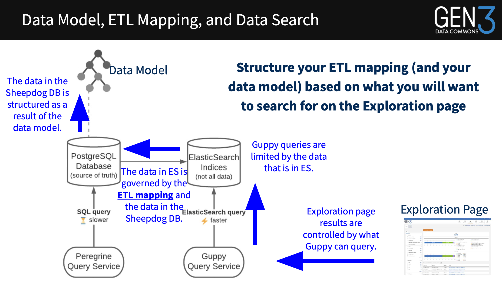

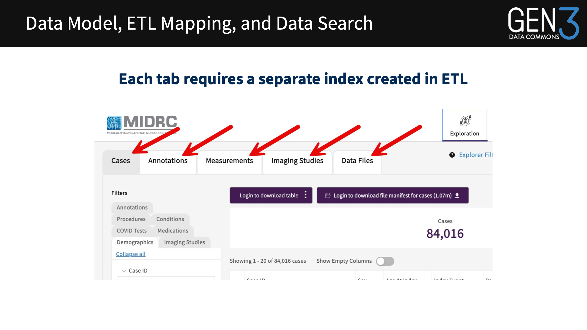

Services involved
-----------------

``Sheepdog``
   Validates structured submissions against the data model and stores the
   resulting graph in PostgreSQL.

``Peregrine``
   Provides a GraphQL interface over the normalized PostgreSQL graph.

``Tube``
   Traverses the graph, selects properties according to the ETL mapping,
   transforms records, and writes Elasticsearch documents. Tube commonly uses
   Apache Spark for the extraction and transformation work.

``Elasticsearch``
   Stores query-optimized documents and indices created from the ETL mapping.

``Guppy``
   Exposes a GraphQL query service over Elasticsearch. Its schema and document
   types must agree with the Tube mapping and the Portal configuration.

``Explorer``
   Uses Guppy to search indexed data and display filters, tables, charts, and
   cohort results.

The data model
--------------

Operators and data contributors collaborate on a data model that makes the
submitted data searchable. A model describes nodes such as subjects, samples,
studies, demographics, and files, together with the relationships between
those nodes.

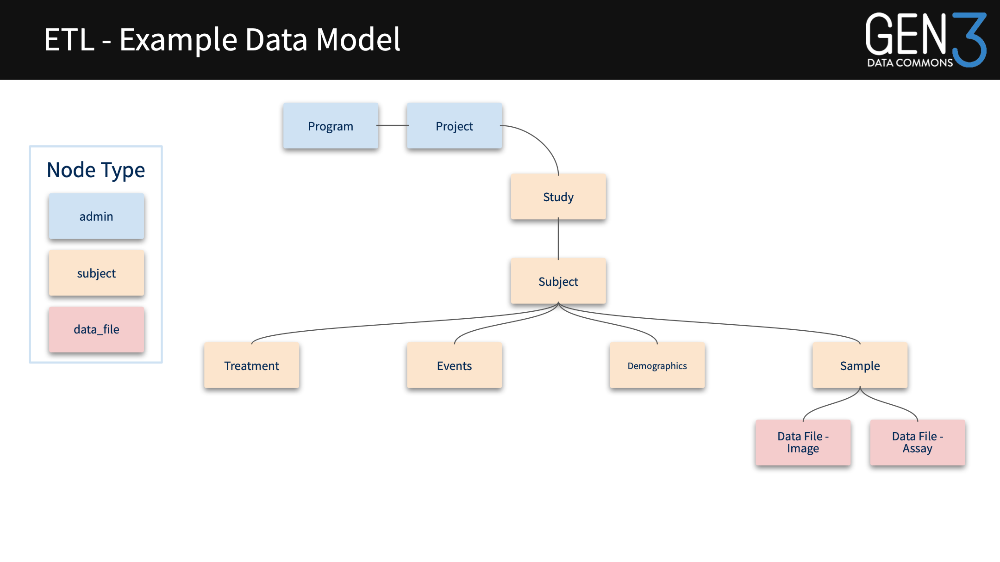

A data model is not itself the Explorer configuration. It is the source graph
from which the ETL mapping selects and reshapes data for search.

ETL mapping structure
---------------------

An ETL mapping is YAML. A mapping normally contains the following fields:

``name``
   Name of the Elasticsearch index produced by the mapping.

``doc_type``
   Document type exposed to Guppy and used by Portal configuration.

``type``
   Either ``aggregator`` or ``collector``.

``root``
   Root node for an aggregator mapping. Collector mappings generally select a
   category instead.

``category``
   Node category collected by a collector mapping, such as ``data_file``.

``props``
   Properties copied from the current node.

``flatten_props``
   Properties copied from a directly related child node.

``parent_props``
   Properties collected by walking to parent nodes.

``nested_props``
   Properties collected from related nodes and represented as nested data.

``aggregated_props``
   Statistics calculated across a path, such as counts, sums, lists, or sets.

``injecting_props``
   Values injected into collector documents to make later joins possible.

``joining_props``
   Properties brought into one mapping from another index.

The supported aggregate functions used in these examples are ``count``,
``max``, ``min``, ``sum``, ``list``, and ``set``.

Mapping types
~~~~~~~~~~~~~

Aggregator
   Starts at one root node and gathers selected properties from connected
   nodes into one document per root. A subject or case index is a typical
   aggregator.

Collector
   Traverses nodes of a category and creates one document per collected node.
   A data-file index is a typical collector.

A minimal mapping looks like this:

.. code-block:: yaml

   mappings:
     - name: my-data-commons_subject
       doc_type: subject
       type: aggregator
       root: subject
       props:
         - name: submitter_id

Flatten properties: one-to-one
------------------------------

``flatten_props`` copies properties from a directly related child node into the
root document. In this example, demographics are flattened into a subject
index.

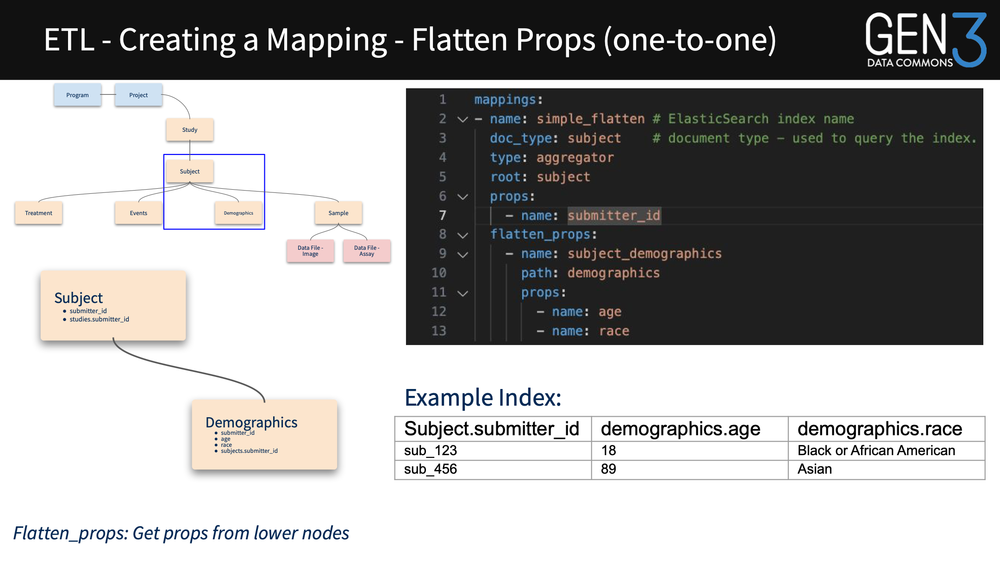

The complete example is available as
:download:`flatten-props-one-to-one.example.yaml <manifest/flatten-props-one-to-one.example.yaml>`.

.. code-block:: yaml

   mappings:
     - name: simple_flatten
       doc_type: subject
       type: aggregator
       root: subject
       props:
         - name: submitter_id
       flatten_props:
         - name: subject_demographics
           path: demographics
           props:
             - name: age
             - name: race

Example index:

.. list-table:: Flattened demographics
   :header-rows: 1
   :widths: 35 20 35

   * - Subject.submitter_id
     - demographics.age
     - demographics.race
   * - sub_123
     - 18
     - Black or African American
   * - sub_456
     - 89
     - Asian

Flatten properties: many-to-one
--------------------------------

When a root node has several related events, ``sorted_by`` can select the
relevant record order. The example below sorts events by date descending.

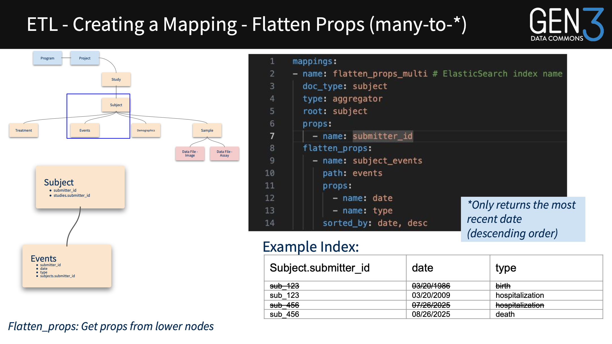

.. code-block:: yaml

   mappings:
     - name: flatten_props_multi
       doc_type: subject
       type: aggregator
       root: subject
       props:
         - name: submitter_id
       flatten_props:
         - name: subject_events
           path: events
           props:
             - name: date
             - name: type
           sorted_by: date, desc

Example index:

.. list-table:: Most recent event per subject
   :header-rows: 1
   :widths: 30 25 35

   * - Subject.submitter_id
     - date
     - type
   * - sub_123
     - 03/20/2009
     - hospitalization
   * - sub_456
     - 08/26/2025
     - death

Parent properties
-----------------

``parent_props`` walks from a root node to an ancestor and brings selected
ancestor properties into the root document.

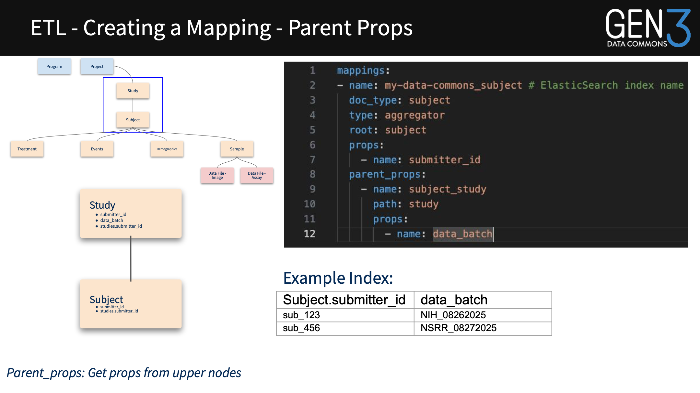

.. code-block:: yaml

   mappings:
     - name: my-data-commons_subject
       doc_type: subject
       type: aggregator
       root: subject
       props:
         - name: submitter_id
       parent_props:
         - name: subject_study
           path: study
           props:
             - name: data_batch

Example index:

.. list-table:: Parent properties
   :header-rows: 1
   :widths: 40 40

   * - Subject.submitter_id
     - data_batch
   * - sub_123
     - NIH_08262025
   * - sub_456
     - NSRR_08272025

Nested properties
-----------------

``nested_props`` preserves related records as nested structures. It is useful
when a subject contains samples and each sample contains one or more files.

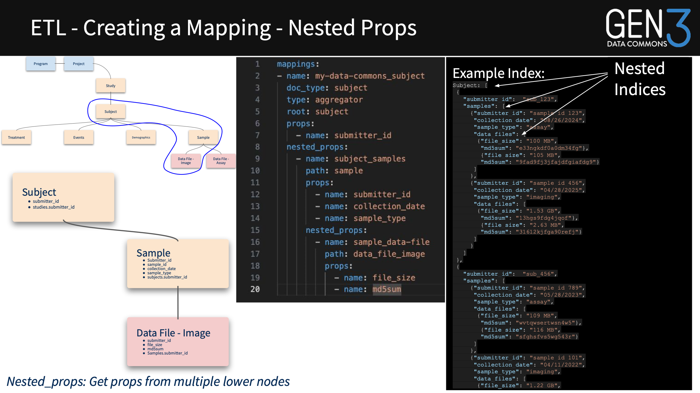

.. code-block:: yaml

   mappings:
     - name: my-data-commons_subject
       doc_type: subject
       type: aggregator
       root: subject
       props:
         - name: submitter_id
       nested_props:
         - name: subject_samples
           path: sample
           props:
             - name: submitter_id
             - name: collection_date
             - name: sample_type
           nested_props:
             - name: sample_data-file
               path: data_file_image
               props:
                 - name: file_size
                 - name: md5sum

Example nested document:

.. code-block:: json

   {
     "subject": [
       {
         "submitter_id": "sub_123",
         "samples": [
           {
             "submitter_id": "sample_id_123",
             "collection_date": "08/26/2024",
             "sample_type": "assay",
             "data_files": [
               {"file_size": "100 MB", "md5sum": "e33n..."}
             ]
           }
         ]
       }
     ]
   }

Skipping nodes
~~~~~~~~~~~~~~

A dotted nested path can skip an intermediate node. Here, the mapping travels
from ``subject`` through ``sample`` to ``data_file_image`` without exposing the
intermediate node as a separate nested block.

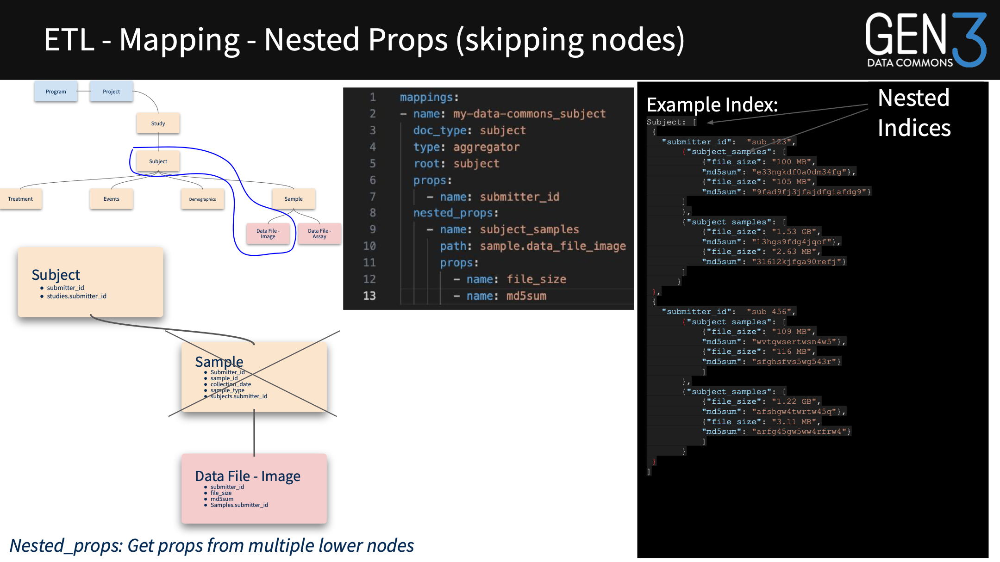

.. code-block:: yaml

   mappings:
     - name: my-data-commons_subject
       doc_type: subject
       type: aggregator
       root: subject
       props:
         - name: submitter_id
       nested_props:
         - name: subject_samples
           path: sample.data_file_image
           props:
             - name: file_size
             - name: md5sum

Aggregated properties
---------------------

``aggregated_props`` calculates statistics over a path. This example counts
samples for each subject while also retaining selected sample properties.

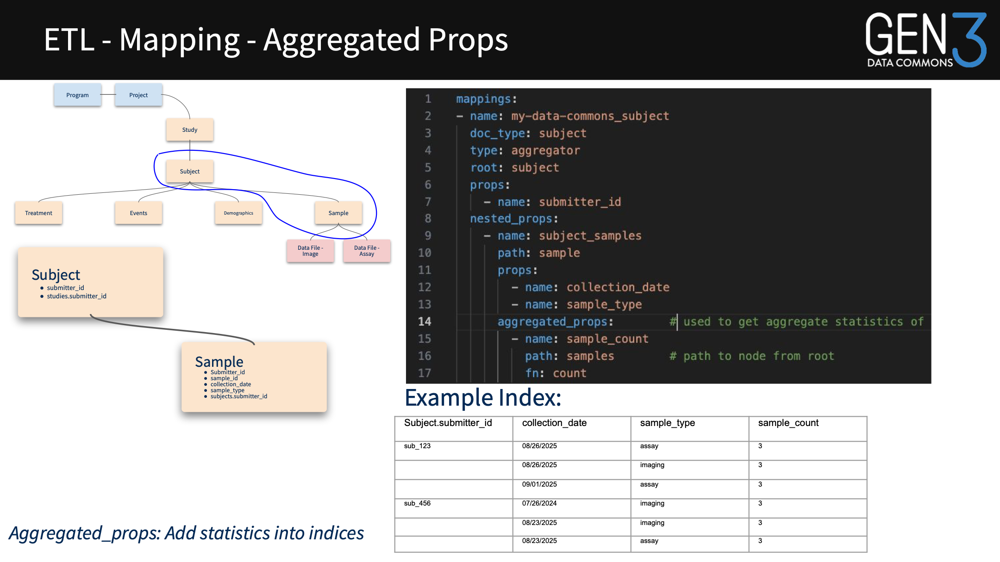

.. code-block:: yaml

   mappings:
     - name: my-data-commons_subject
       doc_type: subject
       type: aggregator
       root: subject
       props:
         - name: submitter_id
       nested_props:
         - name: subject_samples
           path: sample
           props:
             - name: collection_date
             - name: sample_type
       aggregated_props:
         - name: sample_count
           path: samples
           fn: count

Injecting properties
--------------------

Collectors can inject a parent identifier into each collected document. The
injected value can then be used to connect file documents back to subjects.

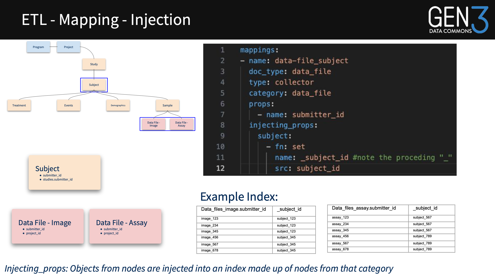

.. code-block:: yaml

   mappings:
     - name: data-file_subject
       doc_type: data_file
       type: collector
       category: data_file
       props:
         - name: submitter_id
       injecting_props:
         subject:
           - fn: set
             name: _subject_id
             src: subject_id

Joining properties
------------------

``joining_props`` connects data from one index to another. The collector first
makes a join key available; the aggregator then uses that key to bring file
properties into a root document.

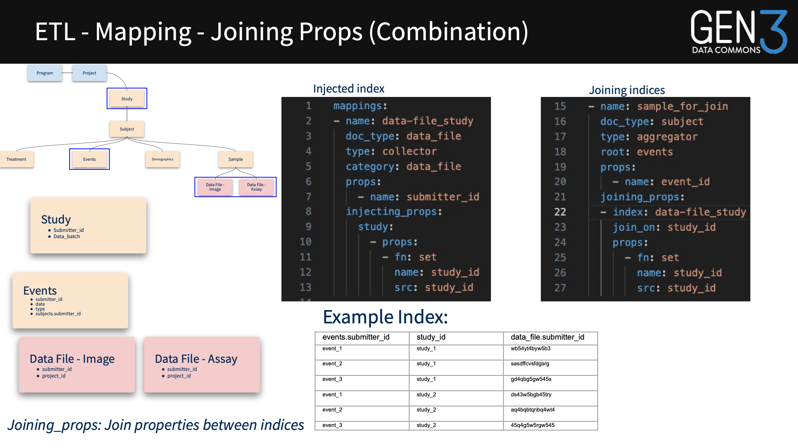

.. code-block:: yaml

   mappings:
     - name: data-file_study
       doc_type: data_file
       type: collector
       category: data_file
       props:
         - name: submitter_id
       injecting_props:
         study:
           - props:
               - fn: set
                 name: study_id
                 src: study_id

     - name: sample_for_join
       doc_type: subject
       type: aggregator
       root: events
       props:
         - name: event_id
       joining_props:
         - index: data-file_study
           join_on: study_id
           props:
             - fn: set
               name: study_id
               src: study_id

Building a file manifest
------------------------

A file manifest combines subject-level context with collected file metadata.
A common design is:

#. Create an aggregator index rooted at ``subject`` with demographics and
   sample data.
#. Create a collector index for ``data_file`` nodes.
#. Inject a subject or study identifier into the file documents.
#. Join the file index to the aggregator to expose the files associated with
   each subject or study.

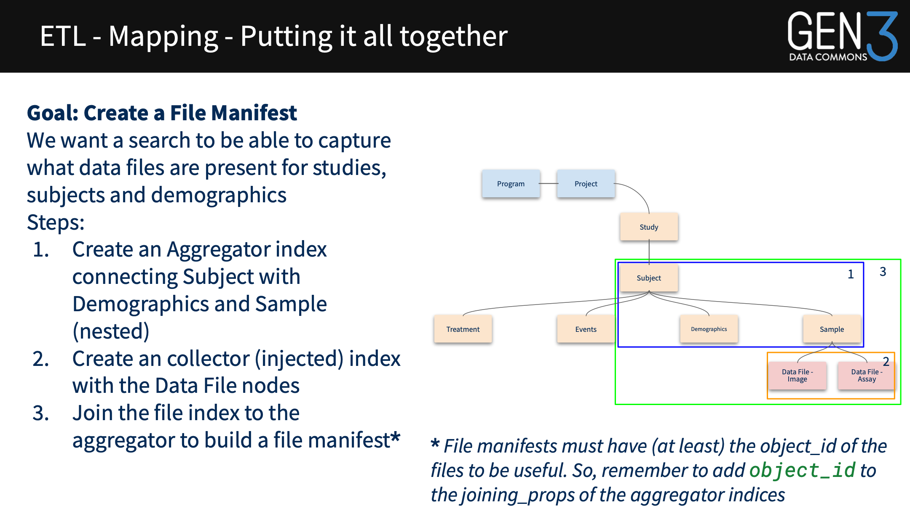

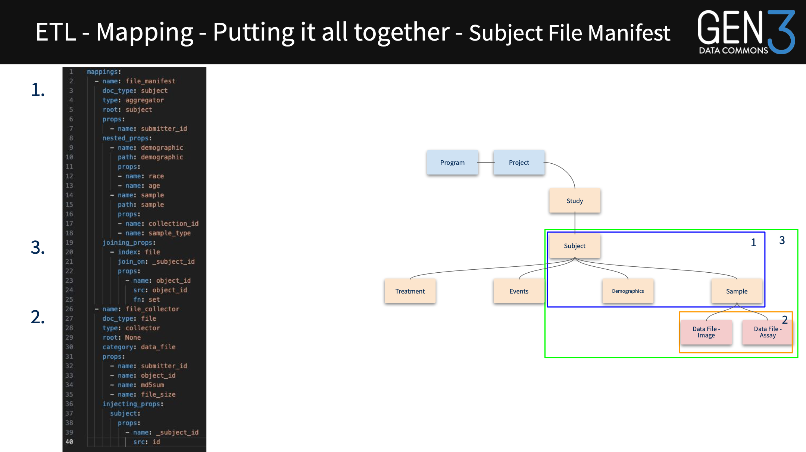

Troubleshooting
---------------

ETL checks
~~~~~~~~~~

Before debugging the frontend, verify the pipeline in order:

* Confirm that the new ETL mapping was deployed.
* Run ETL after deploying the mapping.
* Re-roll Guppy after ETL completes.
* Check Tube and Guppy startup logs for mapping, schema, or JSON errors.
* Confirm that the Portal/FEF Explorer configuration matches the Guppy
  document types and Elasticsearch indices.

Useful commands include:

.. code-block:: console

   kubectl logs <etl-pod-name> -c tube -f
   kubectl exec -it <es-proxy-pod> -- sh
   kubectl port-forward svc/elasticsearch 9200:9200
   curl -X GET http://localhost:9200/_cat/indices
   curl -X GET http://localhost:9200/<index-name>

If data is not in Elasticsearch, inspect the ETL log, check property names and
paths, look for special characters in Sheepdog data, and confirm the path with
Peregrine queries. If data is in Elasticsearch but not queryable, inspect Guppy
logs and verify that ``doc_type`` and index names agree across the ETL, Guppy,
and Portal configurations.

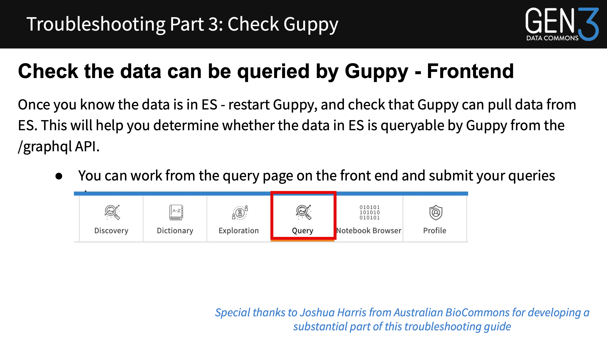

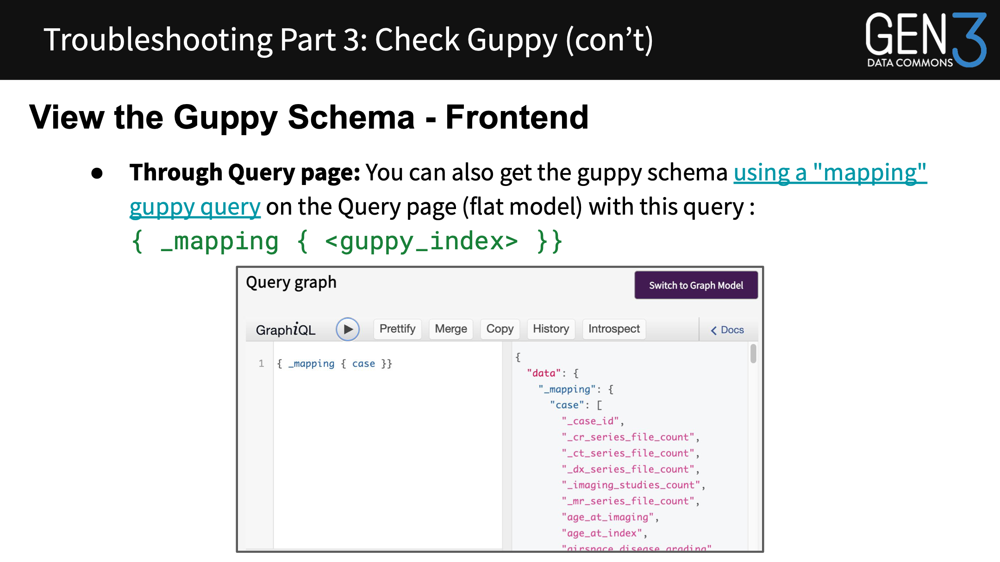

Frontend query troubleshooting
~~~~~~~~~~~~~~~~~~~~~~~~~~~~~~

Use browser developer tools to inspect GraphQL requests:

* The Network tab shows request status and response payloads.
* A ``200`` response indicates that the request reached the endpoint; inspect
  the response body for application-level errors.
* The query payload should contain the expected index, document type, fields,
  filters, and authorization context.

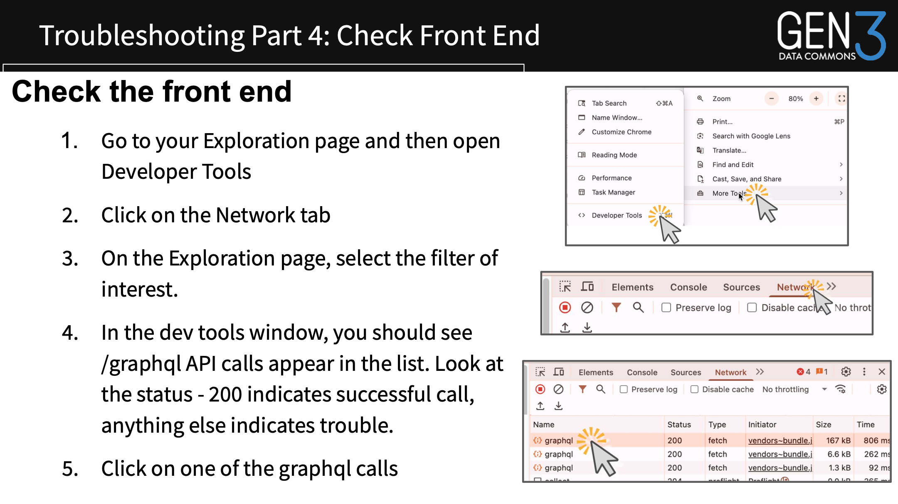

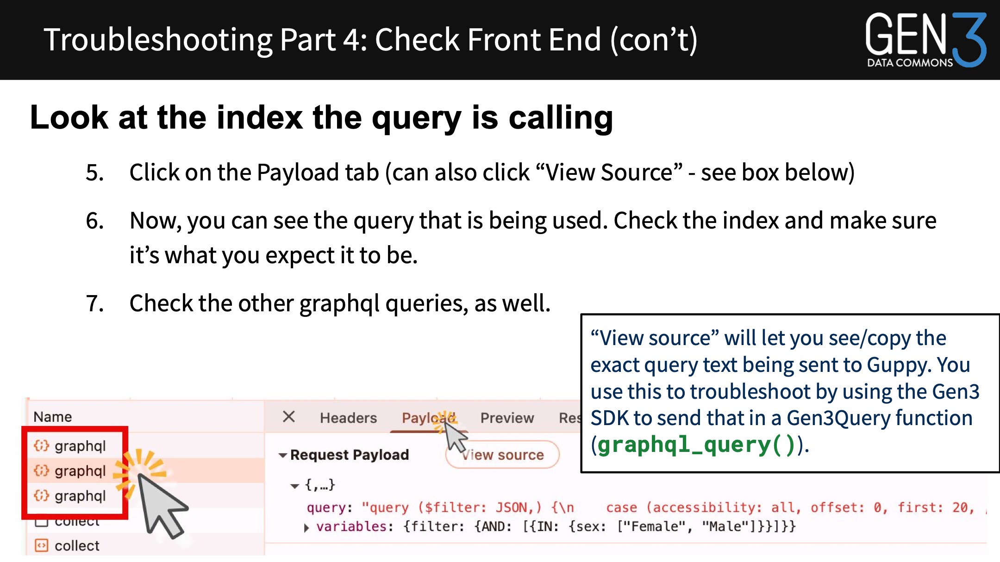

Configuration alignment
-----------------------

The following names must remain aligned across the data commons:

.. list-table:: ETL configuration alignment
   :header-rows: 1
   :widths: 25 35 40

   * - Layer
     - Configuration
     - Required agreement
   * - Dictionary
     - Node and property names
     - Defines the submitted source fields.
   * - Tube
     - Root, paths, properties, and ``doc_type``
     - Selects fields and creates the search document.
   * - Elasticsearch
     - Index and field mappings
     - Contains the documents and types expected by Guppy.
   * - Guppy
     - Index, data type, array configuration, and auth field
     - Matches Tube and Elasticsearch.
   * - Portal
     - Explorer data types, fields, filters, and charts
     - Requests fields exposed by Guppy.

References
----------

* ``Gen3 Forum September 2025 - ETL.pdf`` in the
  ``docs/source/datacommons/extra-material`` directory.
* :download:`Generic ETL mapping reference <manifest/etlMapping.example.yaml>`
* :download:`Flatten props, one-to-one <manifest/flatten-props-one-to-one.example.yaml>`
* :download:`Flatten props, many-to-one <manifest/flatten-props-many-to-star.example.yaml>`
* :download:`Parent props <manifest/parent-props.example.yaml>`
* :download:`Nested props <manifest/nested-props.example.yaml>`
* :download:`Nested props skipping nodes <manifest/nested-props-skipping-nodes.example.yaml>`
* :download:`Aggregated props <manifest/aggregated-props.example.yaml>`
* :download:`Injecting props <manifest/injecting-props.example.yaml>`
* :download:`Joining props <manifest/joining-props.example.yaml>`
* :download:`Subject-file manifest <manifest/subject-file-manifest.example.yaml>`
